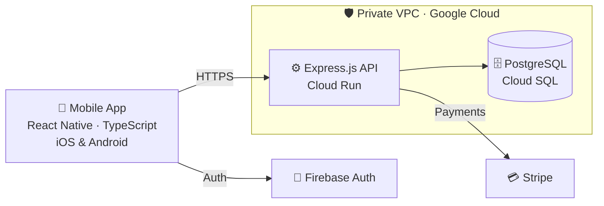

<!-- Header -->
<p align="center">
  
</p>

<p align="center">
  <a href="https://app.thejemv.cloud/">
    
  </a>
</p>

<p align="center">
  <a href="https://app.thejemv.cloud/"></a>
  <a href="https://github.com/TheJemv"></a>
  <a href="https://www.linkedin.com/in/emiliomontesv/"></a>
  <a href="mailto:emiliomontesv@hotmail.com"></a>
  <a href="https://ko-fi.com/O2Z825GOS2"></a>
</p>

<p align="center">
  
</p>

---

## 🧑‍💻 About me

I'm a **Full Stack Developer** and co-founder of **Workly Services**, where I build mobile apps from the idea all the way to production. I built and launched our app on **iOS and Android**, with payments between clients and companies powered by **Stripe**, authentication with **Firebase**, and a secure **Express.js + PostgreSQL** backend running on **Google Cloud**.

```ts
const jose = {
  role: ["CTO & Co-Founder @ Workly Services", "Full Stack Developer"],
  location: "Matamoros, Tamaulipas, México 🇲🇽",
  education: "Information Technology Engineering @ Universidad Tecnológica de Matamoros (2023 – 2027)",
  focus: ["Mobile", "Backend", "Cloud"],
  currentlyBuilding: "Workly Services — live on iOS & Android 📱",
  askMeAbout: ["React Native", "Stripe payments", "Firebase Auth", "Google Cloud"],
  portfolio: "https://app.thejemv.cloud/",
};
```

---

## 🚀 Workly Services

> **CTO & Co-Founder · Full Stack Developer**, responsible for every technical decision, from the mobile app to the cloud infrastructure.

<table>
  <tr>
    <td width="50%" valign="top">

**📱 Mobile app**<br>
Built with React Native and TypeScript, live on iOS and Android.

**💳 Payments**<br>
Full payment system between clients and companies with Stripe.

**🔐 Authentication**<br>
Login and user authentication with Firebase.

</td>
    <td width="50%" valign="top">

**🛠️ Backend**<br>
REST API with Express.js and PostgreSQL.

**☁️ Cloud**<br>
Deployed on Google Cloud with Cloud Run and Cloud SQL.

**🛡️ Security**<br>
Private VPC network, so the database is never exposed to the internet.

</td>
  </tr>
</table>

### 🏗️ Architecture



### 🏆 Achievements

- 🚀 Launched **Workly Services** on iOS and Android as co-founder and CTO
- 🛡️ Designed a **secure cloud architecture** on Google Cloud with a private network (VPC) for the database

---

## 🧰 Tech stack

<p align="center">
  <a href="https://skillicons.dev">
    
  </a>
</p>

<p align="center">
  
  
  
  
  
  
</p>

| Area | What I do |
| :-- | :-- |
| 📱 **Mobile** | iOS & Android apps with React Native |
| 🎨 **Frontend** | React and TypeScript interfaces |
| 🛠️ **Backend** | REST APIs with Express.js |
| 💳 **Payments** | Stripe integrations between clients and businesses |
| 🔐 **Auth** | User authentication with Firebase |
| 🗄️ **Databases** | SQL / PostgreSQL design and management |
| ☁️ **Cloud** | Deployments on Google Cloud (Cloud Run, Cloud SQL, VPC) |

---

## 📊 GitHub stats

<p align="center">
  
  
</p>

<p align="center">
  
</p>

---

## 🎓 Education

**Information Technology Engineering** · Universidad Tecnológica de Matamoros · *2023 – 2027*

---

## ☕ Support my work

If my projects or code have helped you, you can buy me a coffee on Ko-fi. Every bit of support helps me keep building! 💙

<p align="center">
  <a href="https://ko-fi.com/O2Z825GOS2"></a>
</p>

---

## 📫 Let's connect

I'm always open to talking about mobile apps, backend architecture, and building products from scratch.

<p align="center">
  🌐 <a href="https://app.thejemv.cloud/"><b>Portfolio</b></a> &nbsp;·&nbsp;
  💼 <a href="https://www.linkedin.com/in/emiliomontesv/"><b>LinkedIn</b></a> &nbsp;·&nbsp;
  🐙 <a href="https://github.com/TheJemv"><b>GitHub</b></a> &nbsp;·&nbsp;
  📧 <a href="mailto:emiliomontesv@hotmail.com"><b>Email</b></a> &nbsp;·&nbsp;
  ☕ <a href="https://ko-fi.com/O2Z825GOS2"><b>Ko-fi</b></a>
</p>

<!-- Footer -->
<p align="center">
  
</p>
